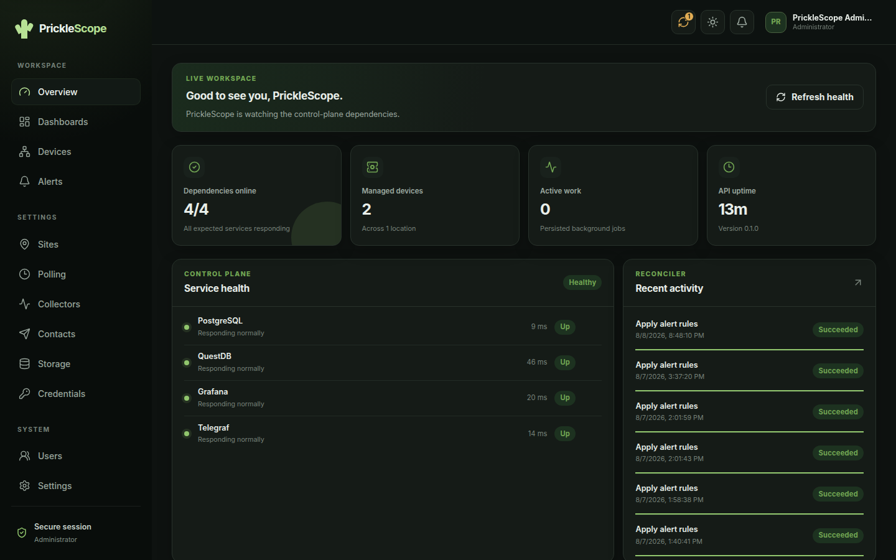
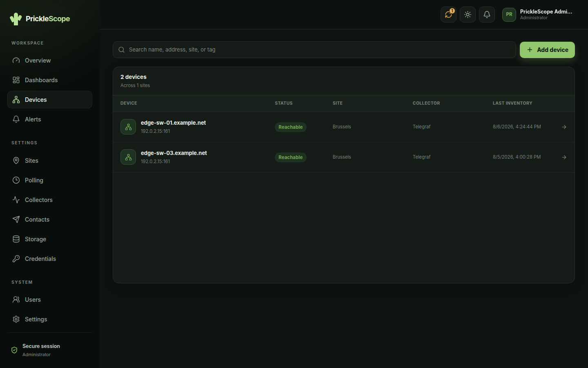
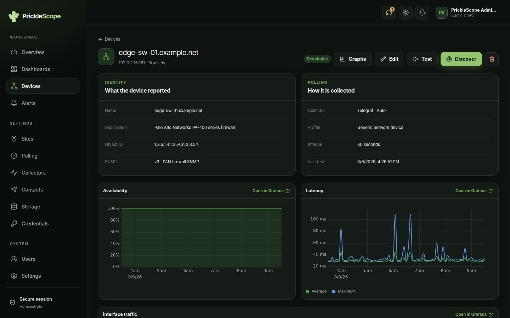
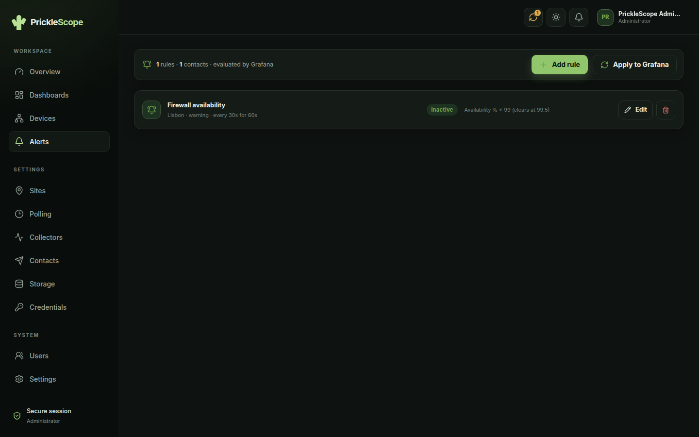
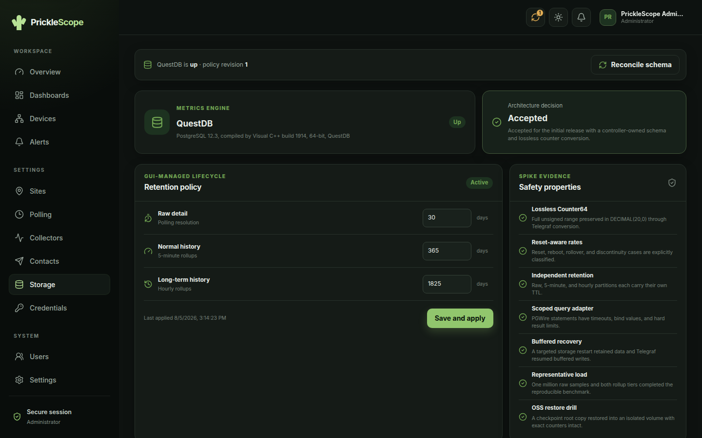

<div align="center">

# PrickleScope

**Network monitoring you configure in a browser, built on the tools you already trust.**

Grafana, Telegraf, and QuestDB do the work. PrickleScope owns their configuration
so you do not have to.

[](LICENSE)
[](#built-entirely-with-ai)

</div>

---



## The problem this solves

Telegraf and Grafana are excellent. The trouble starts around the fortieth device.

Adding a switch means editing a TOML file, remembering which SNMP credential it
uses, restarting a collector, then building a dashboard that looks like the last
twelve dashboards, then writing an alert rule with a query you copy from a rule
that already works. None of it is hard. All of it is a file, and the files
multiply, and eventually the configuration is the system and nobody remembers why
one device polls every thirty seconds.

Commercial products solve this by replacing the tools. You get a GUI and lose
Telegraf, or you get a GUI that renders its own charts and Grafana becomes a
place you no longer look.

**PrickleScope keeps the tools and takes the files.** You add a device on a
screen. It writes Telegraf's configuration, creates the QuestDB tables, builds the
Grafana dashboards, and provisions the alert rules — and it tells you, honestly,
when what it would write differs from what is running.

And it stops there. **Grafana and Telegraf remain fully open to you**: build your
own dashboards, add your own collector inputs, query QuestDB directly. The
controller only ever touches the resources it created, so nothing you make by hand
is overwritten, and nothing you already have has to be given up. See
[Grafana and Telegraf stay yours](#grafana-and-telegraf-stay-yours).

## What it looks like

<table>
<tr>
<td width="50%"><br><em>Inventory. Add a device on a form, not in a file.</em></td>
<td width="50%"><br><em>What the device reported, and how it is doing.</em></td>
</tr>
<tr>
<td width="50%"><br><em>Threshold rules. Grafana evaluates them; you never write the query.</em></td>
<td width="50%"><br><em>Retention in three tiers, applied to QuestDB for you.</em></td>
</tr>
</table>

## What it does

- **Onboard a device** with its address, credential, and polling profile. SNMP
  discovery reads back what it actually is.
- **Collect** through Telegraf, from configuration PrickleScope generates,
  publishes atomically, and can roll back to any previous revision.
- **Store** in QuestDB with three retention tiers and materialized rollups, so a
  five-year trend does not cost five years of raw samples.
- **Graph** in the product itself — interactive, theme-aware charts with no
  third-party chrome — _and_ in Grafana, which always carries at least the same
  panels and usually more.
- **Alert** on sustained thresholds with hysteresis, pending duration, and
  explicit No Data handling. Grafana evaluates; PrickleScope owns the rules.
- **Notify** by webhook, or by email through your mail provider's API — Microsoft
  Graph, Gmail, SendGrid, Mailgun, Postmark, or Nylas. No SMTP relay required.
- **Extend it yourself** with Grafana dashboards and Telegraf inputs of your own,
  which the controller never touches.
- **See drift.** Every reconciled engine reports whether what PrickleScope would
  write matches what is running, by comparing content, not timestamps.

## What it is not

Being clear about this saves everyone time:

- **Not a Grafana replacement.** Grafana keeps a superset of every graph
  PrickleScope draws, plus interface detail and pipeline health the controller
  does not attempt. It is one click away and it is meant to be used.
- **Not a general-purpose observability platform.** SNMP and ICMP against network
  devices. No logs, no traces, no APM.
- **Not clustered.** One host, one of each container. See
  [deployment size](docs/operations.md#supported-deployment-size) for the numbers
  that have actually been tested.
- **Not released yet.** See [Maturity](#maturity).

## Standard containers, not a platform

Everything PrickleScope manages is a normal, replaceable service running from a
pinned upstream image:

| Container  | What it is                    | Owned by                           |
| ---------- | ----------------------------- | ---------------------------------- |
| `web`      | Caddy — TLS and the built SPA | This project                       |
| `api`      | Fastify — the controller      | This project                       |
| `telegraf` | Upstream Telegraf             | Configuration generated by the API |
| `questdb`  | Upstream QuestDB              | Schema and retention by the API    |
| `grafana`  | Upstream Grafana              | Dashboards and rules by the API    |
| `postgres` | Upstream PostgreSQL           | Controller metadata only           |

Nothing is forked and nothing is wrapped in a proprietary layer. Every image is
pinned by tag **and** digest, so you always know exactly what is running.

## Grafana and Telegraf stay yours

This is the part most GUI-on-top products get wrong, so it is worth being precise:
**PrickleScope only ever touches the resources it created.** Everything you build
yourself in Grafana and Telegraf keeps working, and keeps working across
reconciles, upgrades, and restarts.

**Add your own Grafana dashboards.** Open Grafana, build whatever you like. The
reconciler records the uid of every resource it creates and acts only on that
list — it never enumerates your dashboards, never deletes one it does not
recognise, and never overwrites one it did not write. Your dashboards can query
the same QuestDB data source PrickleScope provisioned, so you are building on top
of the collection it manages rather than beside it.

**Add your own Telegraf inputs.** Telegraf loads two things: the base
configuration at `infra/config/telegraf/telegraf.conf`, which is yours to edit,
and the generated directory the controller publishes into. Put any input you want
in the base file — a `[[inputs.snmp]]` for a device with an unusual MIB, an
`[[inputs.http_response]]`, a `[[inputs.exec]]` for something only a script can
reach — and it runs alongside the generated SNMP and ping inputs, writing to the
same QuestDB.

**Query the data directly.** QuestDB speaks PostgreSQL wire protocol and has its
own console. Nothing about the schema is hidden, and nothing stops you pointing
another tool at it.

The one rule: `infra/runtime/telegraf/` is controller-owned and rewritten on every
reconcile, so hand edits there are lost. Everywhere else is yours.

Which is also the answer to the obvious question — if you ever want to walk away,
what you leave with is a working Grafana, a working Telegraf, and a QuestDB full
of your metrics. There is nothing to migrate off.

## Quick start

You need [Docker](https://docs.docker.com/engine/install/) with Compose v2, and
Node 24.

```bash
git clone <this repository> pricklescope
cd pricklescope
nvm use                  # Node 24; see .nvmrc
./scripts/dev-up.sh
```

That checks your prerequisites, generates a credential key, starts four
containers, applies migrations, creates an administrator, and opens the dev
servers. It is safe to run again.

Then open **http://localhost:5173** and sign in as `admin` — the password is in
the `.env` it just created.

To add something worth looking at, walk **Credentials → Sites → Devices →
Collectors → Storage**. [The development guide](docs/development.md) has the
details, including what to do when a step does not work.

For a real deployment, read [the deployment guide](docs/deployment.md) — it covers
TLS, secrets, backups, and the checks that refuse to let you start with a
development password.

## Who it is for

People who run a network of tens to hundreds of devices, already know and like
Grafana and Telegraf, and would rather not hand-maintain the configuration that
connects them. If you are comfortable with Docker Compose and a `.env` file, you
are the intended audience.

If you have five devices, a couple of static Telegraf files are simpler and you
should keep them. If you have fifty thousand, this is the wrong architecture.

## How it is put together

```text
 Browser ──HTTPS──▶ Caddy ──┬── /api ──────▶ Fastify API ──┬──▶ PostgreSQL   desired state
                            │                              ├──▶ QuestDB      metrics
                            └── /grafana ──▶ (same API,     ├──▶ Grafana      dashboards, alerts
                                             session        └──▶ Telegraf     generated config
                                             checked)
```

The controller never becomes a second metrics store, never proxies raw SQL to the
browser, and never embeds Grafana in a page. `/grafana` deliberately routes
through the API, which is what checks your session and reconstructs the identity
Grafana sees.

[docs/architecture.md](docs/architecture.md) explains the reasoning;
[docs/implementation.md](docs/implementation.md) records every decision with what
it cost.

## Maturity

**Pre-release.** No version has been published yet.

What works and has been verified against a live stack: device and credential
management, users and OIDC, Telegraf reconciliation with rollback, QuestDB
storage with retention and rollups, native graphs with matching Grafana
dashboards, threshold alerting with real notification delivery, drift detection,
a TLS production gateway, and tested backup and restore.

What is not finished: health dashboards for the controller itself, an
accessibility audit, usability testing, and the release workflow. Milestone 8 in
[docs/implementation.md](docs/implementation.md) lists exactly what is open.

Security has been through a dedicated verification pass — 127 executable security
assertions, an OWASP ASVS 5.0 and API Top 10 assessment, static analysis, secret
scanning, and an authenticated dynamic scan. That found a critical defect and
three high ones, all fixed. The
[verification report](docs/security/verification.md) is honest about what it did
not cover.

## Built entirely with AI

**Every line of this project was written by an AI assistant**, working from a
human owner's direction. No part of the code, the tests, the documentation, or
this README was hand-written by a person.

That is disclosed plainly because you should be able to weigh it. What it means in
practice:

- Decisions are numbered and written down with their trade-offs, because the
  reasoning would otherwise be lost between sessions. There are 35 of them in
  [docs/implementation.md](docs/implementation.md).
- Comments explain _why_, usually naming the bug that produced the line.
- Several test suites are built to fail when they stop covering anything — the
  authorization matrix fails when a route has no entry, and the security scanners
  fail if they cannot find a planted secret.
- The security review found real defects, including one that allowed command
  execution on the collector host. AI wrote that bug and AI found it. Draw your
  own conclusions about how much assurance to take from either fact.

## Documentation

[docs/](docs/README.md) is the index. The short version:

| I want to…                   | Read                                    |
| ---------------------------- | --------------------------------------- |
| Run it locally               | [development.md](docs/development.md)   |
| Deploy it properly           | [deployment.md](docs/deployment.md)     |
| Know how big a host it needs | [operations.md](docs/operations.md)     |
| Upgrade a component          | [upgrades.md](docs/upgrades.md)         |
| Understand the design        | [architecture.md](docs/architecture.md) |
| Report a vulnerability       | [SECURITY.md](SECURITY.md)              |
| Contribute                   | [CONTRIBUTING.md](CONTRIBUTING.md)      |

## Licence

[GNU Affero General Public License v3.0](LICENSE). If you run a modified
PrickleScope as a service for other people, you must offer them your changes.
