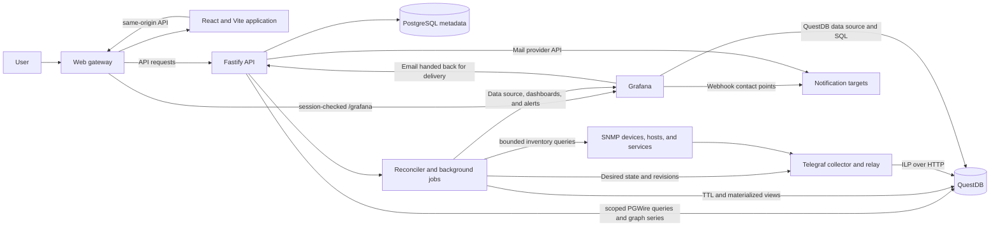
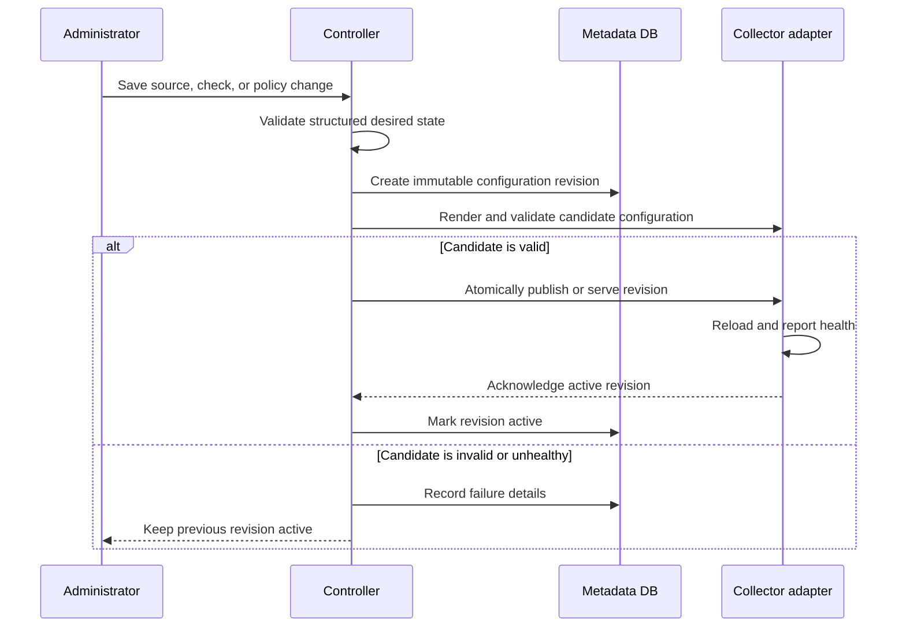

# PrickleScope Architecture

Status: Accepted baseline; QuestDB accepted by the Milestone 4 storage spike  
Scope: Initial single-node deployment with a path to remote collectors  
Current direction: React and Vite, Fastify on Node 24, PostgreSQL, Telegraf and
QuestDB, and Grafana

Implementation progress is tracked in [implementation.md](implementation.md).

## Vision

Build a monitoring system that is as easy to operate as Cacti while using modern,
well-supported components for collection, time-series storage, visualization, and
alerting.

An administrator should be able to add a source, choose what to monitor, set a
retention policy, create a threshold alert, and open useful graphs without editing
collector, database, or Grafana configuration files.

Grafana is a fixed part of the system: it evaluates alerts, routes notifications,
and carries the full visualization surface. The controller draws the graphs its own
screens need, and Grafana holds at least those same graphs and usually more.
Collector and storage integrations are kept behind controller-owned adapters so
they can evolve without changing the product-facing workflow.

## Decision status

| Area                         | Current decision                                                     | Status                                  |
| ---------------------------- | -------------------------------------------------------------------- | --------------------------------------- |
| Web application              | React with Vite                                                      | Selected                                |
| API and background work      | Fastify on Node.js with TypeScript                                   | Selected                                |
| Authentication               | Local accounts and OpenID Connect (OIDC)                             | Selected                                |
| Application metadata         | PostgreSQL                                                           | Selected                                |
| Visualization                | PrickleScope first; Grafana carries the same graphs and more         | Selected                                |
| Alert evaluation and routing | Grafana-managed alerting                                             | Selected for the initial implementation |
| Primary collector            | Telegraf                                                             | Proposed default                        |
| Additional collector         | None                                                                 | Dropped (D-024); Telegraf covers it     |
| Metrics storage              | QuestDB                                                              | Selected for the initial implementation |
| Graph presentation           | PrickleScope draws its own graphs; Grafana holds the same dashboards | Selected                                |

QuestDB is the only metrics store in this design. PostgreSQL stores application
configuration and desired state, not a second copy of time-series measurements.
This is not a hybrid metrics-storage architecture.

## Product principles

1. **Simple by default**: common network monitoring should need only a source,
   credential, and polling profile.
2. **Flexible underneath**: collection and storage implementations are adapters,
   but the first release implements a deliberately small supported set.
3. **GUI-managed**: day-to-day configuration is managed through the controller;
   generated Telegraf, QuestDB, and Grafana artifacts are not hand-edited.
4. **One metrics store**: all supported collection paths converge on QuestDB in
   the proposed deployment.
5. **Use existing tools well**: collectors collect, QuestDB stores, and Grafana
   visualizes, evaluates alerts, and routes notifications. The controller
   coordinates them rather than rebuilding their engines. It draws the graphs its
   own screens need, and Grafana keeps at least those and usually more.
   The single exception is the controller's own dependency health, which it
   writes to QuestDB itself (D-041) — Grafana can only alert on rows in QuestDB,
   and the alternative was publishing an unauthenticated endpoint naming which
   internals are down. It collects nothing from a monitored device.
6. **Safe changes**: configuration is validated, versioned, observable, and
   reversible.
7. **Progressive disclosure**: basic users see sensible defaults and an automatic
   collector choice; advanced options remain available.
8. **No collector leakage**: dashboards and alerts use a normalized metric model
   rather than depending on which collector produced a measurement.
9. **Server-owned infrastructure access**: browsers never receive collector,
   QuestDB, PostgreSQL, or Grafana service credentials.
10. **Purposeful interface hierarchy**: navigation and page context are clear
    without repeating the selected menu label as a large visible page heading.

## System overview

Prometheus-ecosystem collectors have no direct QuestDB output: their metrics path
is Prometheus Remote Write, while QuestDB's recommended ingestion protocol is
InfluxDB Line Protocol (ILP). Telegraf therefore also acts as an ingestion relay:
its HTTP listener accepts Prometheus Remote Write, normalizes the samples, and
forwards them to QuestDB using ILP. Nothing uses that path since Alloy was dropped
(D-024), but it is retained — it is also the Telegraf liveness port.

The relay is an implementation detail. An administrator chooses a collector in
the frontend and does not configure protocols or intermediate files.

## Components

### Controller

The controller is the product-facing application. It consists of a React and Vite
web application, a Fastify API, and background reconciliation and discovery jobs.
The API and jobs may run in one process for the first release, but they have
separate module and lifecycle boundaries so slow network work never blocks HTTP
request handling.

Responsibilities:

- Manage sites, sources, credentials, polling profiles, checks, and collectors.
- Authenticate local and OIDC users and enforce application permissions.
- Recommend a collector for each input and allow an explicit supported override.
- Present schema-backed forms instead of raw Telegraf TOML.
- Test source connectivity before enabling collection.
- Run bounded, on-demand SNMP inventory queries and retain discovered metadata.
- Generate, validate, publish, and reconcile collector runtime configuration.
- Query QuestDB through a server-side adapter for status, previews, and inventory
  context without exposing database credentials to the browser.
- Manage QuestDB tables, TTLs, materialized views, and rollup health.
- Provision the Grafana data source and built-in dashboards.
- Create and reconcile Grafana-managed alert rules, contact points, and policies.
- Track collector, relay, storage, rollup, alert, and configuration health.
- Maintain configuration revisions and a security-sensitive audit trail.
- Link users to Grafana dashboards with the relevant variables selected.

The controller does not continuously poll measurements, store measurements, or
evaluate threshold conditions itself. It does render the graphs on its own screens
(D-019), from bounded server-side queries rather than by embedding Grafana. Bounded
connectivity and inventory probes are controller jobs, while recurring measurement
polling remains the responsibility of the collector.

### Controller application stack

The accepted initial application stack is:

- **React and Vite** for the authenticated administration SPA.
- **Fastify on Node.js with TypeScript** for the HTTP API.
- **A background job and reconciliation layer** within the API codebase initially,
  separable into its own process when scale or failure isolation requires it.
- **PostgreSQL** for users, sessions, desired state, jobs, audit events, and
  reconciliation state.
- **A same-origin web gateway** that serves the SPA and routes `/api` to Fastify
  and authenticated `/grafana` requests to Grafana.

The browser talks only to the same-origin application, including the `/grafana`
route the API proxies. Grafana is never embedded in a PrickleScope page (D-019);
reaching it means navigating to it through that same-origin path.
Fastify owns all infrastructure adapters. QuestDB queries use its PostgreSQL wire
protocol through a standard Node PostgreSQL client because that path supports bind
parameters. Its REST `/exec` API is reserved for narrowly documented operations
where PGWire is unsuitable; arbitrary user input is never concatenated into SQL.
ILP remains the metrics-ingestion protocol and is not used as the application
query API.

Long-running actions such as SNMP inventory, source tests, collector validation,
dashboard reconciliation, and retention changes use persisted jobs with progress,
timeouts, cancellation where practical, and an audit trail. The UI starts a job
and observes its state instead of holding an HTTP request open indefinitely.

### Application metadata database

The metadata database is the source of truth for mutable application state:

- Users and roles
- Local credentials, OIDC identities, server-side sessions, and role mappings
- Sites and monitored sources
- Inventory jobs, snapshots, and administrator-approved inventory changes
- Encrypted credential records
- Input, polling profile, and metric definitions
- Collector capabilities and assignments
- Desired storage, retention, and rollup policies
- Alert definitions and Grafana resource identifiers
- Configuration revisions and reconciliation status
- Audit events

PostgreSQL is selected because it provides a conventional migration, concurrency,
job, session, and backup model. It does not store monitoring measurements.

### Site hierarchy

Sites form an arbitrary-depth tree rather than a fixed campus/building/floor
schema. A site has a stable UUID, an optional parent, and a name that is unique
among its siblings. Devices may be assigned at any level. The API returns the
resolved ancestor path plus direct and whole-subtree device counts so the web
application does not reconstruct organizational rules independently.

Moves preserve site and device identifiers, so metric identity, dashboard links,
and history remain valid when the organization changes. Both the API and
PostgreSQL reject cycles. A site with children cannot be deleted; children must
first be moved or removed, while deleting a leaf leaves its devices unassigned.
Site-scoped fleet graphs include the selected site and all current descendants by
passing their stable site IDs to one reusable dashboard.

### Authentication and authorization

Local authentication and OIDC coexist behind one user and permission model:

- A bootstrap local administrator provides first-run and identity-provider
  recovery access. Additional local users are administrator-managed.
- Local passwords are hashed with Argon2id and are never stored or logged in plain
  text. Login endpoints are rate-limited and protected against enumeration.
- OIDC uses the Authorization Code flow with PKCE, discovery metadata, validated
  issuer, audience, signature, nonce, and state, and a server-held client secret
  when the provider issues one.
- An OIDC identity is keyed by its immutable issuer and subject pair. Accounts are
  not automatically linked solely because email addresses match.
- Server-side sessions are stored in PostgreSQL and represented by Secure,
  HttpOnly, appropriately scoped cookies. State-changing requests receive CSRF
  protection.
- OIDC group-to-role mapping and just-in-time user creation are configurable and
  default to least privilege. Authentication and permission changes are audited.
- Administrators configure the primary OIDC provider through the controller UI.
  PostgreSQL is its only configuration authority; a fresh installation starts
  disabled and GUI changes apply without a process restart.
- OIDC client secrets are write-only and stored as versioned, record-bound
  AES-256-GCM envelopes. Provider discovery must succeed before activation, and
  an active local administrator is required before stored settings can change.
- Administrators manage local and OIDC-provisioned users through one controller
  model. Local passwords are write-only; OIDC issuer and subject bindings remain
  immutable server-side identity records.
- Every authenticated request re-evaluates the user's current role and active
  status. Role, access, and administrator-initiated password changes revoke that
  user's sessions immediately.
- Management safeguards reject self-demotion, self-disable, self-delete, and any
  action that would leave the controller without an active administrator.

Initial roles are deliberately small:

| Role          | Initial capability                                                                    |
| ------------- | ------------------------------------------------------------------------------------- |
| Viewer        | View inventory, health, alerts, and the graphs PrickleScope draws                     |
| Operator      | Viewer access plus manage sources, checks, inventory jobs, and alerts                 |
| Administrator | Operator access plus users, authentication, credentials, storage, and system settings |

Authorization is enforced by Fastify and never only by hiding controls in React.
The permission model can become more granular later without changing identity
storage.

### Telegraf

Telegraf has two possible roles:

1. **Collector** for SNMP, ping, HTTP, databases, and other plugin-based inputs.
2. **Ingestion relay** that accepts Prometheus Remote Write and emits normalized
   ILP to QuestDB. Nothing writes to it now that Alloy is dropped (D-024), but it
   stays because it is also the port the controller's Telegraf liveness probe
   connects to, and it keeps the relay path open.

The initial implementation uses Telegraf for recurring SNMP measurements and
ping. Telegraf's SNMP input already polls individual OIDs and complete tables, so
another custom measurement poller is not required. The controller's bounded
inventory worker described below is a separate on-demand workflow.

Telegraf configuration is generated from structured controller records. Runtime
TOML is an internal, rebuildable artifact rather than a user-managed source of
truth.

The initial SNMP implementation should use:

- SNMP v2c and v3, with v3 `authPriv` preferred.
- The `gosmi` translator backend.
- Generic system and IF-MIB profiles.
- 64-bit high-capacity interface counters when devices support them.
- Per-profile intervals, timeouts, retries, and metric filters.
- Stable identifiers such as `site_id`, `source_id`, `check_id`, `profile`, and
  interface identity.

### SNMP inventory and discovery

Inventory is an explicit controller workflow rather than a side effect hidden
inside recurring collection. A user can test a device, run an inventory query,
preview the result, and decide which discovered interfaces or profiles should be
monitored.

The initial inventory job reads a bounded standard set including system identity,
`sysObjectID`, uptime, and IF-MIB interface identity and status. Vendor enrichment
can be added through versioned profiles. Inventory jobs:

- Support SNMP v2c and v3 using the same encrypted credential records as polling.
- Run outside the API request path with per-device timeouts, retries, concurrency
  limits, progress, and clear partial-failure results.
- Reference credentials by identifier; plaintext secrets are never copied into
  job payloads, results, events, or logs.
- Store timestamped snapshots and show a diff before applying material inventory
  changes such as newly discovered or missing interfaces.
- Perform read-only SNMP operations in the initial release.
- Never write discovered values directly into QuestDB as monitoring measurements.

Automated subnet scanning and topology discovery remain deferred. The first
release inventories a source that the user explicitly supplies.

### Grafana Alloy — dropped (D-024)

Alloy was the proposed second collector for sources that fit the Prometheus
ecosystem better than Telegraf: Prometheus-format endpoints and exporters,
embedded SNMP and blackbox exporters, dynamic service discovery, and
cloud-native collection.

It is not built, and its container is not part of the stack. Telegraf covers the
inputs the product supports, and a second collector would double the desired-state
surface — two renderers, two revision histories, and a duplicate-ownership rule to
keep both from polling the same device.

What survives is the seam rather than the service: a check records which collector
kind owns it, the capability endpoint advertises Alloy as unavailable with the
reason, and Telegraf keeps its Prometheus Remote Write listener. Reintroducing
Alloy means adding a container and an adapter, not reshaping the data model.

### QuestDB

QuestDB is the selected initial time-series store. It is attractive for a Cacti-style
system because its open-source edition supports:

- Partitioned time-series tables
- Automatic per-table TTL
- Incrementally refreshed materialized views
- Independent TTL on materialized views
- High-throughput ILP ingestion
- SQL queries and an official Grafana data source

The controller manages QuestDB through scoped SQL and HTTP connections. Users do
not need the QuestDB Web Console for normal administration.

The Milestone 4 storage spike accepted QuestDB after proving:

- Correct Counter32 and Counter64 ingestion
- Correct reset, discontinuity, and rollover handling
- A stable namespaced schema for Telegraf metrics
- Raw and rollup query performance at the expected scale
- TTL and materialized-view lifecycle behavior
- A documented OSS backup and restore procedure
- A secure deployment path for local and remote collectors

Alloy normalization is no longer a gate; that adapter is dropped (D-024). Grafana
dashboard and alert-query compatibility remain integration gates in Milestones 5
and 6; a failure there can reopen this choice without turning PostgreSQL into a
second metrics store. Reproducible evidence is in
[storage-spike.md](storage-spike.md).

QuestDB's normal ILP integer is signed 64-bit, while SNMP Counter64 is unsigned.
The implementation must define and test an explicit representation rather than
assuming every Counter64 value is safely representable.

### Grafana

Grafana is a visualization engine of the system, alongside the controller's own
graphs, and it owns alert evaluation and notification routing outright.

The division is one of order, not of capability. PrickleScope is where a user
looks first, because its graphs sit in context beside the object they describe.
Grafana carries **at least every graph PrickleScope draws, and in most cases
more** — the full panel set, variables, ad-hoc exploration, panel editing, longer
ranges, and custom dashboards the controller does not attempt.

That is a standing invariant, not a description of today: a native panel is never
added without its Grafana counterpart. Grafana may lead PrickleScope in coverage;
it must never trail it.

D-019 moved in-product visualization to the controller, but evaluation stayed with
Grafana (D-021): alert semantics are stateful and safety-critical, and a missed
alert is a worse failure than an unattractive graph.

Grafana therefore remains the least replaceable component in the architecture, and
more so than before, because alerting has no in-product fallback. Its availability
is a product concern, not only an infrastructure one.

The controller provisions the QuestDB data source, built-in dashboards, and
application-managed alert resources. Advanced users can still create their own
Grafana dashboards and alerts.

Dashboards are templated by variables such as site, source, polling profile, and
interface. The system does not create a separate dashboard for every source.

Initial dashboards:

- Fleet and site overview
- Source overview with availability, latency, and interface traffic
- Interface overview with throughput, errors, and current state
- Collector and ingestion health

Alert state and additional utilization and discard panels follow with Milestone 6.

## Collector selection

The frontend offers three modes for each source assignment or check group:

- **Auto**: use the controller's recommended collector.
- **Telegraf**: force a supported Telegraf input.
- **Grafana Alloy**: not available (D-024). The mode is advertised as
  unavailable with its reason rather than hidden, so the choice is explained.

Collector choice is capability-based, not cosmetic. The UI explains why a
collector is recommended and rejects combinations that do not have a supported
normalization and ingestion path.

Initial recommendation policy:

| Input                                       | Recommended collector | Reason                                     |
| ------------------------------------------- | --------------------- | ------------------------------------------ |
| Arbitrary SNMP OIDs and tables              | Telegraf              | Direct SNMP model and mature table support |
| Generic IF-MIB polling                      | Telegraf initially    | Simplest proven QuestDB ingestion path     |
| Ping and traditional infrastructure plugins | Telegraf              | Broad plugin support                       |
| Prometheus endpoint                         | Not supported         | Would need the dropped Alloy adapter       |
| Prometheus embedded exporter                | Not supported         | Would need the dropped Alloy adapter       |
| Dynamic cloud or Kubernetes discovery       | Not supported         | Would need the dropped Alloy adapter       |

Each check has exactly one active collector owner. Splitting a source across
collectors is allowed only for distinct checks; the controller prevents duplicate
collection of the same metric assignment.

## Normalized metric model

Collector-independent dashboards and alerts require a stable internal metric
contract. Each supported profile defines:

- Canonical metric name
- Metric type: counter, gauge, state, or histogram
- Unit and display metadata
- Stable identity labels
- Allowed high-cardinality attributes
- Counter width and discontinuity hints when applicable
- Recommended rollups, dashboards, and alert templates

Common identity labels include:

- `site_id`
- `source_id`
- `check_id`
- `collector_id`
- `profile`
- Interface identifiers such as `if_index` and a stable interface key

Display names and descriptions should not automatically become indexed identity
labels. This avoids unnecessary cardinality and preserves identity across renames.

QuestDB tables are organized by measurement family, not by source. The accepted
initial raw families are `network_system`, `network_interface`,
`network_interface_rate`, `network_availability`, and `collector_health`.
Interface rates and availability have 5-minute and 1-hour materialized views.

## Configuration lifecycle

Requirements:

- The last known-good configuration remains active after validation failure.
- Generated artifacts are written atomically or served as immutable revisions.
- Every revision has an author, timestamp, content hash, adapter, and result.
- Rollback creates a new revision from a previously valid desired state.
- Effective configuration shown in the GUI is always redacted.
- Remote configuration endpoints require scoped authentication and transport
  encryption.
- The controller does not require access to the Docker socket.

## Storage, retention, and rollups

Tables are shared by measurement family rather than created per source. All rows
carry stable source and check identity so they can be queried independently.

Suggested initial presets:

| Tier      |    Resolution | Default retention | Purpose                                      |
| --------- | ------------: | ----------------: | -------------------------------------------- |
| Raw       | Poll interval |           30 days | Alerting, troubleshooting, and recent detail |
| Normal    |     5 minutes |            1 year | Normal historical dashboards                 |
| Long term |        1 hour |           5 years | Capacity and long-term trends                |

These are GUI-managed presets, not hard-coded limits. The controller translates a
policy into QuestDB table TTL and materialized-view definitions. A materialized
view has its own TTL, allowing raw data to expire while lower-resolution history
remains available.

Shortening retention can make partitions eligible for deletion. The controller
must show the affected tier and earliest retained timestamp, require confirmation,
and record the change in the audit log.

Rollup behavior depends on metric type:

- **Counters**: preserve the raw counter and derive reset-aware deltas or rates
  before aggregation. Ambiguous discontinuities are discarded rather than turned
  into traffic spikes.
- **Gauges**: retain useful combinations of mean, minimum, maximum, and last.
- **States**: retain last value, availability percentage, and relevant state
  changes.
- **Histograms**: preserve their bucket semantics or reject the collector path if
  lossless normalization is not implemented.

QuestDB materialized views support simple aggregates but do not provide
Prometheus-style counter semantics automatically. Counter normalization is
therefore an explicit collector or ingestion responsibility and a technical-spike
exit criterion.

## Grafana integration

The QuestDB data source and built-in dashboards are application-managed. Stable
UIDs keep dashboard links and alert references valid across installations.

The controller uses Grafana's supported APIs for application-managed resources:

- QuestDB data source
- Dashboard folders and dashboards
- Alert-rule groups and rules
- Contact points
- Notification policies and mute timings

Grafana API versions are wrapped behind an adapter because its alert provisioning
APIs are evolving. The selected Grafana image and QuestDB data-source plugin are
pinned and tested together.

Application-managed resources carry a label or annotation such as
`managed_by=pricklescope`. The controller reconciles those resources. Grafana-owned
custom resources are never overwritten.

The first version uses deterministic reusable dashboards. Later, polling profiles
may provide panel templates that the controller uses to create starter dashboards
through the Grafana API.

PrickleScope draws its own graphs. The web application never embeds Grafana — no
iframe, no rendered image, no Grafana stylesheet or script on the page. Charts are
rendered in the browser from purpose-built controller endpoints that read QuestDB
server-side, so a graph carries the product's own typography, colour, and dark
mode rather than Grafana's.

The graphs deliberately resemble Grafana's: the same charting engine Grafana uses
for its time series panels draws them.

Rendering and authorship are separate questions, and the answers differ:

- **In PrickleScope, PrickleScope renders.** Its screens carry a deliberately basic
  set — the graphs an operator needs beside the object they describe.
- **In Grafana, Grafana renders.** It carries the complete set, and more than
  PrickleScope shows: the full panel list, variables, ad-hoc exploration, panel
  editing, and longer ranges the controller does not attempt. Interface detail and
  pipeline health, for instance, exist only there.
- **PrickleScope authors both.** The Grafana dashboards are not hand-built; the
  controller generates and reconciles them from its own desired state, exactly as
  it does for Telegraf configuration and QuestDB schema.

So Grafana is a visualization engine of the system rather than a fallback, and the
controller is the single author of what either surface shows.

Grafana may lead PrickleScope in coverage; it must never trail it. A native panel
is never added without its Grafana counterpart, which is why the panel catalogue
lives in the shared contracts and an adapter test asserts the reconciler still
matches it. Every in-app panel carries an **Open in Grafana** link to its
counterpart with the relevant variables preselected.

Series endpoints are purpose-built, never a SQL pass-through:

- The browser asks for a named graph over a time range; the controller owns the
  query, the table it reads, and the aggregation.
- Each query downsamples in QuestDB the way Grafana's `$__interval` does, so a
  wide range returns a bounded number of buckets rather than every raw sample.
- Series that a legend cannot carry are reduced server-side to the busiest few
  and the response says so, rather than sending hundreds of series to the browser.
- Gaps are explicit nulls, so a stale source draws a break instead of a straight
  line across the outage.

The Grafana gateway remains for the deep links, and stays private and
identity-aware:

- The web gateway exposes Grafana under the same public origin at `/grafana` and
  checks the application session before proxying a request.
- The gateway removes any client-supplied identity headers, then injects trusted
  user and role headers for Grafana Auth Proxy. Grafana accepts such traffic only
  from the gateway and is not directly published in production.
- Grafana `allow_embedding` and anonymous access both stay disabled, and the
  gateway passes Grafana's own framing headers through untouched.
- Application roles map to the minimum Grafana organization role required.
  Application-managed dashboards are read-only to interactive users; custom user
  dashboards live separately and are never reconciled over.
- Production uses HTTPS and secure cookies.

The trade-off is deliberate: the controller now owns in-app charting, which
softens the "Grafana visualizes" division of labour. In exchange the product's own
screens are its own — no third-party chrome, branding, or fonts inside them — and
Grafana remains the fuller, more capable view one click away.

## Threshold monitoring and notifications

Threshold monitoring is a first-class product feature. Administrators define an
alert in the controller, while Grafana performs evaluation and notification
routing. The controller owns the desired state and surfaces the resulting status
in its own screens; it does not run an evaluation loop of its own.

QuestDB is not a candidate for this work. It has no user-defined alerting, and its
only alerting path forwards QuestDB's own CRITICAL log lines to Prometheus
Alertmanager, which reports on the database's health rather than on thresholds
over monitored data.

Evaluation is deliberately not reimplemented, even though the controller does draw
its own graphs. The two are not symmetric: charting is presentational, while alert
evaluation is stateful and safety-critical. Pending duration, hysteresis, No Data
versus Error, flapping, deduplication, silences, and delivery retries are the parts
that are easy to get subtly wrong, and a missed or flapping alert is a worse
failure than an unattractive graph.

Alert rules carry one constraint the dashboards do not: Grafana evaluates them
standalone, with no dashboard variables. The controller therefore generates
concrete per-scope SQL for each rule rather than reusing a panel query.

An alert definition contains:

- Source, check, metric, and optional interface scope
- Reducer such as last, average, minimum, or maximum
- Comparison operator and threshold
- Evaluation interval
- Pending duration for which the condition must remain true
- Optional recovery threshold for hysteresis
- Severity, labels, summary, and description
- No-data and query-error behavior
- Contact point or notification route
- Optional maintenance or mute timing

Example:

| Setting      | Value            |
| ------------ | ---------------- |
| Metric       | CPU utilization  |
| Scope        | `server-01`      |
| Condition    | Greater than 90% |
| Evaluate     | Every 1 minute   |
| Pending      | 10 minutes       |
| Recovery     | Below 85%        |
| Severity     | Warning          |
| Notification | Operations email |

With this rule, a short spike does not send a notification. The condition must
remain true throughout the ten-minute pending period. The lower recovery threshold
prevents repeated state changes around 90%.

Metric definitions carry units, so the UI does not present a percentage threshold
for a value that is not a percentage. For example, Linux load average must be
normalized by CPU count before it is displayed as utilization.

Initial alert templates:

- Source unreachable
- Expected data missing or stale
- Collector or relay unhealthy
- Collector configuration revision failed
- Administratively-up interface operationally down
- Interface utilization high for a sustained period
- Error or discard rate above a threshold
- Disk, memory, or CPU utilization high
- QuestDB ingestion or materialized-view lag

No-data behavior is explicit per rule. A missing measurement can mean a source is
down, a collector is down, or a check was disabled; those states must not silently
be treated as a numeric zero.

Notifications leave over HTTP; SMTP is not supported (D-022). A contact point is
either a webhook the operator names, or email sent through a mail provider's API —
Microsoft Graph, Gmail, SendGrid, Mailgun, Postmark, or Nylas. Recipient addresses,
contact points, and per-rule routing are GUI-managed and controller-owned.

Grafana evaluates and routes both kinds, but it cannot deliver the email one: its
webhook receiver posts a single fixed JSON shape, and no mail API accepts it —
Gmail takes a base64url RFC-2822 blob, Mailgun form encoding, and Graph and Gmail
need an OAuth exchange Grafana cannot perform. An email contact point is therefore
provisioned as a webhook aimed back at the controller's `/api/v1/alerts/notify/{ref}`
endpoint with a generated bearer token, and the controller renders and sends the
message (D-023). Grafana keeps evaluation, grouping, dedup, and routing; the
controller keeps the provider credentials and the delivery outcome.

That callback means Grafana must be able to reach the API. The address is
configuration (`PRICKLESCOPE_NOTIFY_BASE_URL`), never something an operator is
asked for, and applying alerts refuses when the API listens only on loopback while
Grafana would have to reach it from a container.

## Drift between desired and applied state

The controller owns desired state and the engines hold applied state, so the two
diverge the moment anything is edited. Each reconciled domain reports its own
drift by making the same comparison its reconciler makes — a rendered
configuration hash for collectors, managed-resource hashes for Grafana, per-rule
revisions for alerts, an applied marker for storage. Nothing infers drift from
timestamps, because a timestamp cannot distinguish an edit that changed the
artifact from one that did not.

A single control aggregates those reports and applies the targets that have
changes, as jobs. The rule that keeps it honest: a probe must be exactly as
strict as its reconciler. If applying cannot clear what the probe reports, the
indicator is worse than having none.

## User experience and visual language

The application uses a calm, information-dense operations interface rather than a
generic administration template. It has a persistent, collapsible side navigation
and a compact global bar reserved for search, active alerts, background activity,
theme, and the user menu. Status is communicated with text and iconography as well
as color.

A selected navigation label is not repeated as a large visible heading. For
example, selecting **Devices** opens directly on the search/filter/action toolbar
and device content, not a banner whose only content is “Devices.” Context comes
from the active navigation item and browser document title. The page still has a
visually hidden level-one heading and correct landmark structure for screen-reader
and keyboard navigation.

Visible headings are used when they add information. A device detail view may
start with the device's name, reachability, address, and primary actions because
those distinguish the current object; it does not add a generic “Device” heading
above them.

Further interface rules:

- Primary actions are near the content they affect; common tasks do not hide in
  overflow menus.
- Tables support fast search, filtering, sorting, saved views, bulk actions, and
  useful empty, loading, stale, partial, and error states.
- Forms begin with sensible defaults and reveal advanced polling, storage, and
  alert options progressively.
- Connectivity tests, inventory, and reconciliation show live job state and
  actionable failures instead of indefinite spinners.
- Destructive or data-expiring changes show impact and require confirmation.
- Embedded graphs match the application theme and use responsive containers with
  a useful fallback link to Grafana.
- Keyboard navigation, focus visibility, contrast, reduced motion, responsive
  layout, and WCAG 2.2 AA are release requirements.
- User-facing terminology follows the domain vocabulary in this document and
  avoids leaking collector or database configuration details unnecessarily.

## Terminology

To avoid overloading the term "data source," the application uses:

- **Source**: a monitored device, service, or endpoint.
- **Input**: the collection mechanism, such as SNMP, ping, or Prometheus scrape.
- **Check**: one configured input applied to a source.
- **Collector**: a Telegraf runtime executing checks.
- **Destination**: the time-series system receiving measurements, initially
  QuestDB.
- **Grafana data source**: Grafana's configured connection to QuestDB.
- **Alert definition**: controller-owned desired state for a Grafana-managed rule.
- **Contact point**: a notification destination — a webhook, or email through a
  mail provider API. Both are controller-owned desired state.

Most installations need one Grafana data source and many monitored sources.

## Domain model

The initial domain model contains:

- **Site**: a stable, arbitrary-depth logical or physical grouping whose optional
  parent forms the site tree.
- **Source**: address, display name, tags, enabled state, and site.
- **Credential**: encrypted SNMP or other input credentials.
- **Polling profile**: input type, canonical metrics, interval, timeout, retries,
  dashboards, and recommended alerts.
- **Check/source assignment**: connects a source, credential, profile, collector,
  and destination.
- **Collector**: runtime type, capabilities, location, active revision, and health.
- **Destination**: QuestDB connection and scoped credentials.
- **Storage policy**: raw retention and rollup tier definitions.
- **Alert definition**: threshold, duration, recovery, scope, and notification
  desired state.
- **Managed Grafana resource**: stable UID, resource type, revision, and status.
- **Configuration revision**: immutable desired-state snapshot and application
  result.

Collector adapters implement:

1. Capability metadata and recommendation rules.
2. A form/schema describing allowed settings.
3. Validation and connectivity testing.
4. Configuration rendering or remote configuration delivery.
5. Metric normalization metadata.
6. Health and active-revision reporting.

Storage adapters are kept narrow: connection testing, schema migration, ingestion
configuration, retention, rollups, health, and query metadata. The architecture
does not attempt to make arbitrary time-series databases interchangeable in the
first release.

## Security

- Prefer SNMP v3 `authPriv`; SNMP v2c community strings are unencrypted on the
  network.
- Encrypt stored credentials using an application key supplied as a deployment
  secret and kept outside the metadata database.
- The implemented credential envelope uses AES-256-GCM with a fresh 96-bit nonce,
  a 128-bit authentication tag, and additional authenticated data binding the
  ciphertext to its credential identifier and key version. The recorded version
  makes an unavailable key fail closed; managed bulk key rotation remains a
  hardening milestone.
- Never return an existing secret value to the browser after creation.
- Inject secrets only when rendering or serving collector configuration.
- Restrict generated runtime artifacts and redact logs and previews.
- Use distinct QuestDB identities for controller administration, ingestion, and
  Grafana read-only queries where the selected edition supports them.
- Keep the metadata database, QuestDB SQL interface, and relay listener on the
  internal container network by default.
- Protect remote collector traffic using TLS through a trusted proxy, private
  network, or VPN where the OSS component does not provide the required transport
  security directly.
- Authenticate controller-to-Grafana API calls with a scoped service account.
- Keep Grafana off the directly published production network path; only the web
  gateway may supply trusted Auth Proxy headers, and it strips spoofed inbound
  copies before doing so.
- Do not expose QuestDB, PostgreSQL, collector, or Grafana service credentials to
  browser code. Fastify returns purpose-built response models, not arbitrary SQL
  or infrastructure API pass-throughs.
- Record credential, retention, collector, dashboard, and alert changes in the
  audit log.
- Do not give the controller access to the Docker socket.

Initial administrator credentials, database passwords, encryption keys, and
published ports are bootstrap configuration. Mail delivery is not among them:
notifications are HTTP only and a mail provider is configured through the GUI
like any other contact (D-022). Normal monitoring,
retention, dashboard, alert, and notification-recipient configuration is then
performed through the GUI.

## Backup and recovery

Persistent volumes alone are not backups. The initial deployment must document
and test recovery for:

- Application metadata database
- QuestDB data volume
- Grafana database and plugins
- Controller encryption key and bootstrap secrets

QuestDB OSS does not include the Enterprise incremental backup facility. The
initial design therefore requires a tested filesystem or volume snapshot procedure
with the consistency steps required by QuestDB. GUI-driven backup orchestration is
deferred, but a manual restore test is a release criterion.

Generated collector files, built-in dashboards, and managed alert definitions are
rebuildable from controller desired state and do not require independent backup.

## Deployment model

The first release uses Docker Compose on one host:

| Container  | Purpose                                                      | Required initially |
| ---------- | ------------------------------------------------------------ | ------------------ |
| `web`      | Caddy: TLS, the built SPA, and the same-origin gateway       | Yes                |
| `api`      | Fastify API, reconciler, authentication, and background jobs | Yes                |
| `postgres` | Users, sessions, jobs, metadata, and desired state           | Yes                |
| `telegraf` | Primary collector and Prometheus Remote Write relay          | Yes                |
| `questdb`  | Time-series storage, TTL, and rollups                        | Yes                |
| `grafana`  | Dashboards, alert evaluation, and notifications              | Yes                |

Six containers, not seven: Alloy was dropped rather than deferred (D-024).

Persistent volumes are required for the metadata database, QuestDB, Grafana, and
collector buffering or state. Exact image and plugin versions are pinned; no
production component uses an unpinned `latest` tag.

The architecture later supports remote collectors. A remote collector receives a
scoped revision, reports heartbeats and active revision status, buffers temporary
outages, and writes to the central ingestion path. Collector assignment is already
part of the domain model, so remote execution does not change the user workflow.

## Initial user journeys

### Sign in

1. Open the application and choose local sign-in or the configured OIDC provider.
2. Authenticate without exposing provider tokens to the React application.
3. Enter the same application shell with capabilities derived from the assigned
   Viewer, Operator, or Administrator role.
4. Open an embedded graph without encountering a second Grafana login prompt.

### Add an SNMP device

1. Select **Add source**.
2. Enter a name and hostname or IP address.
3. Select or create an SNMP credential.
4. Use the recommended generic profile or select a vendor profile.
5. Leave collector selection on **Auto** or choose a supported collector.
6. Test connectivity and preview discovered system and interface information.
7. Save and view the embedded device graphs, or open the dashboard in Grafana.

### Add a threshold alert

1. Open a source, interface, or metric.
2. Select **Create alert** or choose a recommended alert template.
3. Set threshold, pending duration, recovery threshold, and severity.
4. Select an existing contact point or add an email recipient.
5. Preview the matching series and save.
6. View the reconciled rule and its current state in both the controller and
   Grafana.

Advanced polling, storage, dashboard, and alert-query settings remain collapsed
unless requested.

## First vertical slice

The first milestone is complete when:

- The required stack starts with one Docker Compose command.
- A bootstrap administrator can sign in locally, and a configured OIDC user can
  sign in and receive the intended application role.
- A user can add and test an SNMP device entirely through the GUI.
- A user can run inventory and preview discovered system and interface data.
- Generic system and IF-MIB metrics reach QuestDB through Telegraf.
- Counter reset handling does not create false traffic spikes.
- Changing a polling interval updates the collector without manual file editing.
- The GUI displays the active configuration revision and collector health.
- The frontend embeds authenticated Grafana availability and interface traffic
  panels for the selected device without anonymous access or URL tokens.
- Raw retention and one rollup tier can be changed through the GUI.
- QuestDB automatically expires raw data according to the configured TTL.
- A user can create `greater than 90% for 10 minutes` alert behavior through the
  GUI and receive a test email or webhook notification.
- A source-stale alert distinguishes missing data from a numeric zero.
- A failed configuration change leaves the previous revision active.
- Backup and restore of metadata, QuestDB, and Grafana have been tested.
- No monitoring credentials are committed to the repository or exposed in logs.

Alloy support is not built at all, and its container is not in the stack (D-024).

## Technical spike before committing to QuestDB

The storage decision is accepted only after a reproducible spike demonstrates:

1. Poll an SNMP v2c and v3 source with system and IF-MIB tables.
2. Ingest gauges, Counter32, and Counter64 values through Telegraf.
3. Simulate a device reboot, counter reset, and rollover/discontinuity.
4. Ingest a second copy of representative metrics through the Telegraf Prometheus
   Remote Write relay without duplicating the production series.
5. Create raw TTL plus 5-minute and 1-hour materialized views with independent
   retention.
6. Query recent raw data and multi-year-equivalent rollups from Grafana.
7. Evaluate a Grafana threshold rule against the QuestDB data source.
8. Interrupt collector-to-storage connectivity and verify buffering, recovery,
   health reporting, and bounded data loss.
9. Back up and restore the OSS deployment using the documented procedure.

Failure of a spike criterion reopens the storage or collector pairing. The primary
fallbacks remain a Prometheus-ecosystem collector with Prometheus-compatible
storage, and Telegraf with TimescaleDB.

## Deferred capabilities

- Global search across devices, sites, and interfaces
- Vendor-specific MIB profile library
- Automated network discovery
- SNMP traps and informs
- Remote and redundant collectors
- Additional Telegraf inputs
- User-defined dashboard generation from arbitrary profiles
- Advanced alert expressions and multi-condition rules
- Additional contact points, chat destinations, and escalation schedules
- Multiple OIDC providers, SCIM provisioning, and multi-tenancy
- High availability
- GUI-driven backup and restore

## Open implementation decisions

Resolved since this list was written, and kept here so the change is visible:

- ~~Same-origin production gateway implementation~~ — Caddy, with `/grafana`
  routed through the API rather than straight to Grafana (D-032). See
  [deployment.md](deployment.md).
- ~~Expected initial source, interface, and series scale~~ — measured and
  documented in [operations.md](operations.md#supported-deployment-size).

Still open:

- Default polling interval and retention presets
- Exact QuestDB table layout and Counter64 representation
- Counter-rate normalization location and state persistence
- Telegraf configuration reload mechanism and relay topology
- Exact local account recovery policy, session lifetimes, and supported OIDC
  provider compatibility matrix
- SNMP client library
- Grafana Auth Proxy role mapping and custom-dashboard permission details

## References

- [Telegraf SNMP input](https://docs.influxdata.com/telegraf/v1/input-plugins/snmp/)
- [Telegraf Prometheus Remote Write input format](https://docs.influxdata.com/telegraf/v1/data_formats/input/prometheus-remote-write/)
- [Telegraf HTTP Listener v2](https://docs.influxdata.com/telegraf/v1/input-plugins/http_listener_v2/)
- [QuestDB Telegraf integration](https://questdb.com/docs/ingestion/message-brokers/telegraf/)
- [QuestDB ILP ingestion](https://questdb.com/docs/ingestion/ilp/overview/)
- [QuestDB TTL](https://questdb.com/docs/concepts/ttl/)
- [QuestDB materialized views](https://questdb.com/docs/concepts/materialized-views/)
- [QuestDB data types](https://questdb.com/docs/query/datatypes/overview/)
- [QuestDB backup and restore](https://questdb.com/docs/operations/backup)
- [QuestDB Grafana integration](https://questdb.com/docs/integrations/visualization/grafana/)
- [QuestDB PostgreSQL wire protocol](https://questdb.com/docs/query/pgwire/overview/)
- [QuestDB REST API](https://questdb.com/docs/query/rest-api/)
- [Grafana Alerting](https://grafana.com/docs/grafana/latest/alerting/)
- [Grafana alert-rule evaluation](https://grafana.com/docs/grafana/latest/alerting/fundamentals/alert-rule-evaluation/)
- [Grafana Alerting Provisioning API](https://grafana.com/docs/grafana/latest/developer-resources/api-reference/http-api/api-legacy/alerting_provisioning/)
- [Grafana QuestDB data source](https://grafana.com/grafana/plugins/questdb-questdb-datasource/)
- [Grafana panel embedding](https://grafana.com/docs/grafana/latest/visualizations/dashboards/share-dashboards-panels/)
- [Grafana Auth Proxy](https://grafana.com/docs/grafana/latest/setup-grafana/configure-access/configure-authentication/auth-proxy/)
- [uPlot charting library](https://github.com/leeoniya/uPlot)
- [Grafana security hardening](https://grafana.com/docs/grafana/latest/setup-grafana/configure-security/configure-security-hardening/)
- [OpenID Connect Core](https://openid.net/specs/openid-connect-core-1_0.html)
- [OAuth 2.0 security best current practice](https://www.rfc-editor.org/rfc/rfc9700.html)
